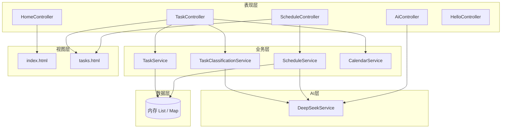
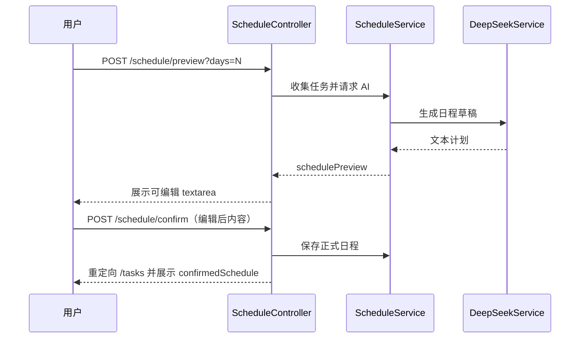

# AI 任务管理平台 — 实训报告

| 项目 | 内容 |
|------|------|
| **课题名称** | 基于 Spring Boot 与 DeepSeek 的 AI 任务管理平台 |
| **实训周期** | 7 天（大学 Java Web 实训） |
| **技术栈** | Java 17、Spring Boot 3.5、Thymeleaf、Bootstrap 5、DeepSeek API |
| **工程路径** | `E:\AI-Task-Manager\ai-task-manager` |
| **撰写说明** | 姓名、学号、指导教师、学院、日期等请按学校模板自行填写 |

---

## 摘要

本实训围绕「AI 任务管理平台」展开，在 7 天内完成从环境搭建、任务 CRUD、大模型接入、日程智能优化到界面美化的完整 Web 应用开发流程。系统采用 **Spring Boot + Thymeleaf** 服务端渲染架构，任务与日程数据在实训阶段使用**内存存储**，通过 **DeepSeek Chat API** 实现任务自动分类、单任务智能分析与多日日程优化预览/确认机制。前端在 Bootstrap 布局基础上，实现了**黑白灰新拟态**视觉、**昼夜主题切换**（View Transitions 圆形扩散）、**翻页时钟**、**水波背景**、**首页打字机动画**与**功能卡片弹入动画**等交互体验。

关键词：Spring Boot；Thymeleaf；DeepSeek；任务管理；日程优化；新拟态 UI

---

## 一、实训背景与目标

### 1.1 背景

高校 Java Web 实训通常要求学生在有限周期内掌握 MVC 分层、HTTP 请求处理、模板渲染与第三方 API 集成。传统待办应用功能单一，难以体现「AI 赋能」趋势。本课题将**任务分类、日历追踪、完成状态管理**与 **大语言模型（LLM）** 结合，形成可演示、可答辩的完整作品。

### 1.2 实训目标

| 序号 | 目标 | 达成情况 |
|------|------|----------|
| 1 | 掌握 Spring Boot 项目创建、启动与基本 REST/页面路由 | ✅ 已完成 |
| 2 | 实现任务增删改查（内存版）与多维度筛选 | ✅ 已完成 |
| 3 | 接入 DeepSeek API，完成分类、分析、日程三类 AI 能力 | ✅ 已完成 |
| 4 | 实现「预览 → 用户编辑 → 确认保存」的日程交互闭环 | ✅ 已完成 |
| 5 | 使用 Bootstrap + 自定义 CSS 完成工作台布局与美化 | ✅ 已完成 |
| 6 | 部署上线、答辩 PPT、演示录屏 | ⏳ Day 7 待完成 |

### 1.3 项目定位

- **用户场景**：个人/实训演示场景下的每日任务整理与计划辅助。
- **产品 slogan**（首页）：把零散任务，整理成清晰计划。
- **差异化**：不仅存任务，还提供 AI 分类、单任务做法建议、多日日程排布草稿。

---

## 二、需求分析

### 2.1 功能需求

依据 `docs/FEATURE-SPEC.md`，系统功能划分为以下模块：

#### （1）任务管理

- 任务字段：标题（必填）、描述、分类、所属日期、完成状态、创建时间。
- **五类分类**：日常（默认）、学习、工作、编程、运动。
- 创建方式：手动选择分类，或点击「AI 自动分类」由模型/规则推断。
- 列表支持：按**分类**、按**选中日期**组合过滤。
- 任务卡片可**标记完成/取消完成**。

#### （2）智能日历

- 左侧小日历展示当月日期。
- 有未完成任务：日期格显示**小点**；当日全部完成：显示**小勾**。
- 点击日期：主区域仅显示该日任务；支持**年月切换**。
- **展开模式**：点击「点击展开」进入全屏日历，展示每日任务摘要；「退回」收起。

#### （3）AI 能力

| 功能 | 输入 | 输出 | 说明 |
|------|------|------|------|
| 自动分类 | 标题 + 描述 | 五类之一 | 本地关键词优先，失败则调用 DeepSeek |
| 单任务分析 | 选中任务 | 做法 + 建议 | 结果展示在任务卡片下方面板 |
| 日程优化 | 当前任务集 + 天数(1–14) | 可编辑预览文本 | 确认后才写入正式日程 |
| API 连通测试 | 可选 prompt | JSON 回复 | `GET /api/ai/test` |

#### （4）界面与体验

- **首页**：项目介绍、进入工作台、功能亮点、翻页时钟、趣味挂件。
- **工作台**：顶栏（返回首页、时钟挂件、昼夜切换）、Hero 统计、左栏导航+日历、主区任务与 AI 区。
- **主题**：浅色/深色一键切换，状态持久化至 `localStorage`。

### 2.2 非功能需求

| 类型 | 要求 | 实现方式 |
|------|------|----------|
| 可维护性 | 分层清晰、注释可读 | Controller / Service / Model / ai 包分离 |
| 可演示性 | 无数据库亦可完整演示 | 内存 List 存储 |
| 安全性 | API Key 不入库、不写死代码 | 环境变量 `DEEPSEEK_API_KEY` |
| 开发效率 | 改 HTML 即生效 | `spring.thymeleaf.cache=false` |
| 兼容性 | 现代浏览器 | View Transitions 不支持时降级为直接切换 |

### 2.3 约束与决策

| 决策项 | 选择 | 理由 |
|--------|------|------|
| 数据持久化 | 先内存，后期 MySQL | 符合 7 天节奏，降低环境成本 |
| AI 实现 | DeepSeek Chat Completions | 国内可用、接口与 OpenAI 兼容 |
| 前端方案 | Thymeleaf SSR + 少量原生 JS | 实训聚焦后端，避免前后端分离复杂度 |
| 日程保存 | 须用户确认 | 避免 AI 草稿误覆盖正式计划 |

---

## 三、技术选型与开发环境

### 3.1 后端技术栈

| 技术 | 版本 | 用途 |
|------|------|------|
| JDK | 17 | 语言运行时 |
| Spring Boot | 3.5.14 | Web 容器、依赖注入、配置 |
| spring-boot-starter-web | — | MVC、内嵌 Tomcat |
| spring-boot-starter-thymeleaf | — | 服务端模板渲染 |
| Maven | 3.x | 构建与依赖管理 |

**未引入（预留扩展）**：Spring Data JPA、MySQL Driver、Spring Security、Redis 等。

### 3.2 前端技术栈

| 技术 | 用途 |
|------|------|
| Thymeleaf | 页面渲染、`th:href`、`th:text` 等 |
| Bootstrap 5.3.3（CDN） | 工作台栅格、表单、工具类 |
| 自定义 CSS | `home.css`（首页）、`app.css`（工作台） |
| 原生 JavaScript | `theme.js`、`hero-typewriter.js` |

### 3.3 第三方服务

| 服务 | 配置项 | 说明 |
|------|--------|------|
| DeepSeek API | `deepseek.api-url`、`deepseek.api-key`、`deepseek.model` | 见 `application.properties` 与 `docs/DEEPSEEK-SETUP.md` |

### 3.4 开发环境与工具

- **IDE**：Cursor / IntelliJ IDEA（推荐）
- **运行**：`mvn spring-boot:run`，默认端口 **8080**
- **辅助**：Cursor Agent、MCP（real-plan、Playwright 等）用于规划与 UI 验证
- **操作系统**：Windows 10/11（本机路径 `E:\AI-Task-Manager`）

---

## 四、系统总体设计

### 4.1 逻辑架构

系统采用经典 **三层架构 + AI 适配层**：



### 4.2 包结构说明

```
com.example.aitaskmanager
├── AiTaskManagerApplication.java    # 启动入口
├── controller/                      # 页面与 API 路由
│   ├── HomeController.java
│   ├── TaskController.java
│   ├── ScheduleController.java
│   ├── AiController.java
│   └── HelloController.java
├── service/                         # 业务逻辑
│   ├── TaskService.java
│   ├── TaskClassificationService.java
│   ├── ScheduleService.java
│   └── CalendarService.java
├── model/                           # 领域模型
│   ├── Task.java
│   ├── TaskCategory.java
│   └── CalendarDay.java
└── ai/
    └── DeepSeekService.java         # HTTP 调用 DeepSeek
```

### 4.3 页面与路由设计

| 方法 | 路径 | 功能 |
|------|------|------|
| GET | `/` | 首页 |
| GET | `/tasks` | 任务工作台（支持 category、selectedDate、selectedMonth、calendarView 参数） |
| POST | `/tasks` | 创建任务 |
| POST | `/tasks/{id}/toggle-completed` | 切换完成状态 |
| POST | `/tasks/classify` | AI/规则自动分类（回填表单） |
| GET | `/tasks/{id}/analyze` | 单任务 AI 分析 |
| POST | `/schedule/preview` | 生成日程预览（参数 days） |
| POST | `/schedule/confirm` | 确认保存正式日程 |
| GET | `/api/hello` | 健康检查 JSON |
| GET | `/api/ai/test` | DeepSeek 连通测试 |

### 4.4 数据模型

#### Task（任务）

| 字段 | 类型 | 说明 |
|------|------|------|
| id | Long | 自增 ID |
| title | String | 标题 |
| content | String | 描述 |
| category | TaskCategory | 枚举五类 |
| taskDate | LocalDate | 任务日期 |
| completed | boolean | 是否完成 |
| createdAt | LocalDateTime | 创建时间 |

#### TaskCategory（枚举）

`DAILY`（日常）、`STUDY`（学习）、`WORK`（工作）、`PROGRAMMING`（编程）、`EXERCISE`（运动）。

#### CalendarDay（日历单元）

用于日历网格渲染：日期、是否当月、是否选中、标记类型（无/未完成点/已完成勾）、任务摘要列表等（由 `CalendarService` 组装）。

#### 正式日程

用户确认后的文本保存在 `ScheduleService` 内存中，重启清空；后期可扩展为 `Schedule` 实体表。

---

## 五、七天实训实施过程

### 5.1 进度总览

| 天数 | 计划目标 | 实际完成内容 |
|------|----------|--------------|
| Day 1 | 环境、Git、项目认知 | （通常含在 Day 2 前准备） |
| Day 2 | Spring Boot 启动 + Hello API + 首页骨架 | 启动类、`HelloController`、`HomeController`、`index` 初版 |
| Day 3 | 任务模型、表单提交、列表、分类过滤 | `Task`、`TaskService`、`TaskController`、`tasks.html` 主流程 |
| Day 4 | 接入 DeepSeek | `DeepSeekService`、环境变量配置、替换 Mock |
| Day 5 | AI 拆解与日程优化 | 分析、预览/确认日程、`ScheduleController` |
| Day 6 | Bootstrap 美化与高级 UI | 新拟态、昼夜切换、日历展开、翻页时钟、水波、打字机、卡片动画 |
| Day 7 | 部署 + 答辩 + 录屏 | **待完成**（见第七章） |

### 5.2 分日说明（摘要）

**Day 2 — 工程奠基**  
创建 Maven 工程，引入 Web 与 Thymeleaf 依赖，验证 `GET /api/hello` 返回 JSON，配置欢迎页 `index.html`。

**Day 3 — 核心业务闭环**  
按 `FEATURE-SPEC.md` 拆解：先模型与内存仓储，再 POST 创建与列表展示，最后左侧五类+「全部」过滤；AI 按钮预留接口。

**Day 4 — 大模型接入**  
在 `application.properties` 配置 DeepSeek；`DeepSeekService` 封装 `RestTemplate`/`WebClient` 风格 HTTP 调用；`TaskClassificationService` 增加关键词兜底；未配置 Key 时页面提示。

**Day 5 — AI 深度功能**  
实现 `GET /tasks/{id}/analyze`；`POST /schedule/preview` 生成可编辑草稿；`POST /schedule/confirm` 写入正式日程；完善 `CalendarService` 月历与展开视图。

**Day 6 — 体验与视觉**  
- 首页：Hero 打字机、功能块弹入、时钟 HH:MM:SS、Cookie Monster 眼球挂件、Canvas 水波。  
- 工作台：玻璃拟态面板、顶栏时钟、侧栏日历动画、任务卡片层次、面板间距优化（避免圆角「沙漏」缺口）。  
- 共用 `theme.js`：View Transitions 昼夜切换、`localStorage` 主题记忆。

**Day 7 — 交付（规划）**  
云部署或内网穿透、MySQL 可选、答辩 PPT 与 3–5 分钟录屏。

---

## 六、核心功能实现说明

### 6.1 任务创建与过滤

- **创建**：`TaskController` 接收表单字段，调用 `TaskService.createTask()` 写入内存列表。
- **过滤**：`GET /tasks` 根据 `category`、`selectedDate` 查询参数过滤；默认展示全部或当日关注日期。
- **完成切换**：`POST /tasks/{id}/toggle-completed` 翻转 `completed` 后重定向，保持查询参数。

### 6.2 智能日历（CalendarService）

- 根据 `selectedMonth`（如 `2026-06`）生成月历网格。
- 遍历任务列表，为每个日期计算标记：未完成 → 点；全部完成 → 勾。
- `calendarView=expanded` 时切换全屏模板状态与收起动画（`tasks.html` 内联脚本 + CSS）。

### 6.3 AI 自动分类（TaskClassificationService）

1. 使用标题+描述匹配**本地关键词规则**（快速、无网络成本）。
2. 规则未命中时调用 `DeepSeekService`，解析模型返回的分类名称并映射到 `TaskCategory`。
3. 分类结果通过 `POST /tasks/classify` 回填到创建表单，用户可修改后再提交。

### 6.4 单任务分析

- 路由：`GET /tasks/{id}/analyze`。
- 将任务标题、描述、分类拼入 Prompt，请求 DeepSeek 生成「做法 + 建议」。
- 结果通过 Model 属性 `analysisResult` 渲染到 `tasks.html` 的 `ai-result-panel`。

### 6.5 日程优化（预览—确认）



该设计保证：**未确认前不影响正式日程**，符合产品可预期性。

### 6.6 DeepSeek 集成要点

配置示例（`application.properties`）：

```properties
deepseek.api-url=https://api.deepseek.com/chat/completions
deepseek.api-key=${DEEPSEEK_API_KEY:}
deepseek.model=deepseek-chat
```

运行前在 PowerShell 设置：

```powershell
$env:DEEPSEEK_API_KEY="你的密钥"
mvn spring-boot:run
```

验证：`GET http://localhost:8080/api/ai/test`

---

## 七、前端与交互设计

### 7.1 设计原则

- **色彩**：黑白灰新拟态（Neumorphism），靠双向阴影制造凹凸感。
- **主题**：`:root[data-theme="light|dark"]` CSS 变量统一驱动。
- **布局**：工作台左窄右宽；首页左文案右时钟、下方三列功能卡。

### 7.2 主要交互清单

| 交互 | 实现文件 | 说明 |
|------|----------|------|
| 昼夜切换 | `theme.js` + View Transitions | 从按钮位置圆形扩散 |
| 翻页时钟 | `theme.js` | `data-clock-format="hms"` 六位翻页 |
| 水波背景 | `theme.js` + `#rippleBg` canvas | 鼠标扩散波纹，主题色插值 |
| 首页打字机 | `hero-typewriter.js` | 标题两行 → 简介 → 按钮淡入 |
| 功能卡弹入 | `hero-typewriter.js` + `home.css` | 错峰 `feature-pop-up` 回弹 |
| 眼球挂件 | `theme.js` | 右下角 Cookie Monster 瞳孔跟随 |
| 日历展开 | `tasks.html` + `app.css` | 遮罩 + 居中放大动画 |

### 7.3 静态资源一览

| 路径 | 作用 |
|------|------|
| `/css/home.css` | 首页样式 |
| `/css/app.css` | 工作台样式 |
| `/js/theme.js` | 主题、时钟、水波、挂件 |
| `/js/hero-typewriter.js` | 首页打字与卡片动画 |

---

## 八、测试与验证

### 8.1 功能测试用例（建议答辩演示顺序）

| 序号 | 步骤 | 预期结果 |
|------|------|----------|
| 1 | 访问 `/` | 首页打字动画、时钟走动、功能卡弹入 |
| 2 | 点击「进入任务工作台」 | 进入 `/tasks` |
| 3 | 创建任务（手动选「学习」） | 列表出现新卡片 |
| 4 | 点击「AI 自动分类」 | 分类字段被智能填充 |
| 5 | 左侧点「编程」 | 仅显示编程类任务 |
| 6 | 小日历选某日 | 主区过滤该日任务 |
| 7 | 展开日历 → 退回 | 动画正常、状态保持 |
| 8 | 点击某任务「AI 分析」 | 下方出现分析文案 |
| 9 | 日程优化 3 天 → 预览 → 编辑 → 确认 | 正式日程区显示确认内容 |
| 10 | `GET /api/ai/test` | 返回模型回复 JSON |
| 11 | 切换昼夜主题 | 圆形扩散、颜色与水波同步 |

### 8.2 常见问题排查

| 现象 | 原因 | 处理 |
|------|------|------|
| 启动失败 exit code 1 | **8080 端口占用** | `netstat -ano \| findstr :8080` 后 `taskkill /PID xxx /F` |
| AI 无响应 | 未设置 `DEEPSEEK_API_KEY` | 参考 `docs/DEEPSEEK-SETUP.md` |
| 改 HTML 不生效 | 模板缓存或浏览器缓存 | 确认 `thymeleaf.cache=false`，Ctrl+F5 |
| 动画看不到 | 访问错页面或旧 JS 缓存 | 首页看打字机；`hero-typewriter.js?v=2` |

### 8.3 自动化测试

- 工程含 `AiTaskManagerApplicationTests`（Spring Boot 上下文加载测试）。
- 业务测试以**手工演示**为主，符合实训交付节奏；后期可补充 MockMvc 集成测试。

---

## 九、遇到的问题与解决方案

### 9.1 技术问题

1. **8080 端口被占用**  
   多次启动未关闭旧进程。通过 `netstat` 查找 PID 并 `taskkill` 释放端口。

2. **DeepSeek Key 未配置**  
   页面显示友好提示。采用环境变量注入，避免密钥进入 Git。

3. **View Transitions 导致布局异常**  
   切换主题后偶发 `clip-path` 残留。在 `theme.js` 中 `resetPageLayoutState()` 清理样式。

4. **相邻圆角面板「沙漏」缺口**  
   新拟态卡片间距过小。引入 `--panel-gap`、`--panel-border` 加大留白与描边。

5. **静态资源未更新**  
   `target/classes` 与源码不同步。执行 `mvn process-resources` 或在模板中为 CSS/JS 加版本参数 `?v=`。

### 9.2 产品与交互问题

1. **AI 入口曾被 UI 精简掉**  
   后端仍保留接口。已在 `tasks.html` 恢复「AI 分析」「AI 日程优化」区块。

2. **打字机动画不显示**  
   旧版 `theme.js` 被缓存。拆分为独立 `hero-typewriter.js` 并缓存刷新。

---

## 十、项目成果与自评

### 10.1 已交付成果

- 可运行的 Spring Boot Web 应用（双页面 + 10 个 HTTP 端点）。
- 完整的任务—日历—AI 业务闭环。
- 文档：`FEATURE-SPEC.md`、`DEEPSEEK-SETUP.md`、`CURSOR-TOOLS.md`、本实训报告。
- 具有辨识度的 Day 6 级 UI（新拟态 + 动效）。

### 10.2 创新点

- **日程「预览—确认」两阶段**，降低 AI 误操作风险。
- **关键词 + LLM 双轨分类**，兼顾速度与智能。
- **日历展开态**任务摘要，提升日期维度可读性。
- **统一主题系统**跨首页与工作台，含高级 CSS 动效。

### 10.3 不足与改进方向

| 不足 | 改进计划 |
|------|----------|
| 数据重启丢失 | 接入 MySQL + JPA |
| 无用户登录 | 增加 Spring Security 多用户 |
| AI 仅文本 | 支持流式输出 SSE |
| 未容器化部署 | Docker + 云主机（Day 7） |
| 自动化测试少 | 补充 MockMvc、Playwright E2E |

---

## 十一、Day 7 交付建议（部署与答辩）

### 11.1 部署方案（三选一）

1. **本机演示**：`mvn spring-boot:run` + 浏览器访问（最简单）。  
2. **内网穿透**：ngrok / 花生壳暴露 8080，外网可访问。  
3. **免费 Java 托管**：Railway、Render 等（需配置环境变量 `DEEPSEEK_API_KEY`）。

### 11.2 答辩 PPT 建议结构（8–12 页）

1. 封面（课题、姓名、指导教师）  
2. 背景与目标  
3. 需求与功能结构图  
4. 技术架构图  
5. 核心流程演示（任务 + AI + 日程）  
6. 界面展示（首页 + 工作台 + 昼夜切换）  
7. 难点与解决（端口、AI Key、UI 动效）  
8. 总结与展望  

### 11.3 录屏脚本（约 3 分钟）

- 0:00–0:30 首页动效与进入工作台  
- 0:30–1:30 创建任务、分类过滤、日历  
- 1:30–2:30 AI 分类、分析、日程预览确认  
- 2:30–3:00 昼夜切换 + 总结  

---

## 十二、总结

本实训以 **AI 任务管理平台** 为载体，完整走过了 **需求分析 → 架构设计 → 编码实现 → 联调测试 → 体验优化** 的软件工程 mini 流程。后端巩固了 Spring Boot MVC 与 Service 分层；前端在 Thymeleaf 体系下实现了现代化交互；AI 模块通过 DeepSeek 将「智能」落到分类、分析与日程三个场景。当前系统已具备答辩演示条件，后续 Day 7 重点应放在**部署可访问性**与**答辩材料**上，并视学分要求决定是否接入 MySQL 持久化。

---

## 附录

### 附录 A 参考文献与资料

1. Spring Boot 官方文档：https://spring.io/projects/spring-boot  
2. Thymeleaf 官方文档：https://www.thymeleaf.org/  
3. Bootstrap 5 文档：https://getbootstrap.com/docs/5.3/  
4. DeepSeek API 文档：https://platform.deepseek.com/api-docs/  
5. 项目内 `docs/FEATURE-SPEC.md`、`docs/DEEPSEEK-SETUP.md`

### 附录 B 工程目录（精简）

```
ai-task-manager/
├── pom.xml
├── src/main/java/com/example/aitaskmanager/
├── src/main/resources/
│   ├── application.properties
│   ├── static/css|js/
│   └── templates/index.html, tasks.html
└── src/test/java/...
```

### 附录 C 个人分工说明（模板）

| 成员 | 学号 | 负责模块 | 工作量 |
|------|------|----------|--------|
| （填写） | | 后端 Task/Schedule | |
| （填写） | | 前端 UI/主题 | |
| （填写） | | AI 集成与测试 | |
| （填写） | | 文档与答辩 | |

> 若为个人实训，可改为「本人独立完成全栈开发与文档撰写」。

---

**报告结束** — 可根据学校格式要求导出为 Word/PDF，并补充封面、诚信声明与成绩页。
